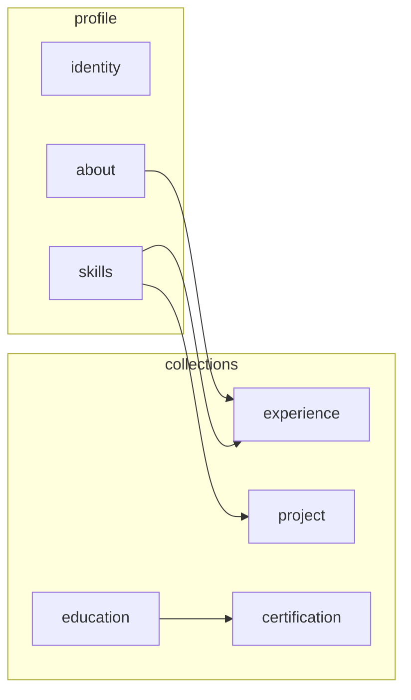

# Esquema de entidades (perfil profissional)

Os arquivos de dados ficam na pasta raiz **`knowledge-base/`** do repositório.

Este documento define o **modelo lógico** do backup em Markdown: tipos, identificadores, arquivos e relações informais. Pastas usam nomes em **inglês** para estabilidade em código e MCP; o conteúdo dos arquivos permanece em **pt-BR** e/ou **en-US**.

## Tipos (`type`)

| Tipo            | Descrição                                                                         | Layout de arquivos                                         |
| --------------- | --------------------------------------------------------------------------------- | ---------------------------------------------------------- |
| `profile`       | Blocos únicos do perfil (Sobre, identidade, preferências, serviços, competências) | `profile/{id}.md`                                          |
| `experience`    | Cargo / empresa                                                                   | `experience/{id}/pt-br.md` e `en-us.md`                    |
| `education`     | Instituição de ensino                                                             | `education/{id}/pt-br.md` e `en-us.md`                     |
| `certification` | Licença ou certificado                                                            | `certification/{slug}.md` (PT + seção EN no mesmo arquivo) |
| `project`       | Projeto do portfólio                                                              | `project/{slug}.md`                                        |

## Identificadores (`id`)

- **Regra:** minúsculas, ASCII, palavras separadas por **hífen** (`kebab-case`).
- **Experiência e educação:** o `id` da pasta é o slug estável (ex.: `sh-squads`, `spro-it-solutions`, `mobilesys-sistemas`).
- **Certificados e projetos:** o `id` costuma coincidir com o nome do arquivo **sem** `.md` (ex.: `rocketseat-nodejs`, `go-barber`).
- **Perfil:** nomes fixos: `identity`, `about`, `job-preferences`, `services`, `skills-highlight`, `skills`.

Evite renomear pastas/arquivos sem atualizar [`manifest.yaml`](../manifest.yaml) e os links em [`INDEX.md`](../INDEX.md) e nos `_index.md` de cada coleção.

## Relacionamentos (informais)

Não há FK formal; as ligações são por **texto** e **navegação**:

- **Competências** em `profile/skills.md` citam empresas e projetos por nome.
- **Experiências** podem listar competências do cargo.
- **Formação** (Rocketseat) alinha tematicamente com **certificados** Rocketseat e **projetos** da mesma origem.
- **Projetos** podem referenciar políticas de link em `certification/_index.md`.

## Locales

| Arquivo                                        | Conteúdo                                                                  |
| ---------------------------------------------- | ------------------------------------------------------------------------- |
| `pt-br.md`                                     | Versão em português (Brasil)                                              |
| `en-us.md`                                     | Versão em inglês (EUA)                                                    |
| `*.md` único em `certification/` ou `project/` | Corpo principal PT (tabelas) + bloco _English (reference)_ quando existir |

## Índices e manifesto

| Artefato                                                                                      | Função                                                    |
| --------------------------------------------------------------------------------------------- | --------------------------------------------------------- |
| [`INDEX.md`](../INDEX.md)                                                                     | Ponto de entrada humano                                   |
| [`manifest.yaml`](../manifest.yaml)                                                           | Lista máquina: `id`, `type`, caminhos, `locales`, títulos |
| `experience/_index.md`, `education/_index.md`, `certification/_index.md`, `project/_index.md` | Tabelas por coleção                                       |

## Evolução (opcional)

- Adicionar **YAML frontmatter** no topo dos `.md` com `id`, `type`, datas — sem remover tabelas legíveis.
- Gerar **SQLite** ou índice de busca a partir de `manifest.yaml` + frontmatter.

## Como adicionar um registro

1. Criar arquivo(s) no tipo certo, seguindo um existente como modelo.
2. Incluir linha no `_index.md` da coleção.
3. Acrescentar entrada em `manifest.yaml`.
4. Se for tipo novo, atualizar esta página e o `INDEX.md`.
